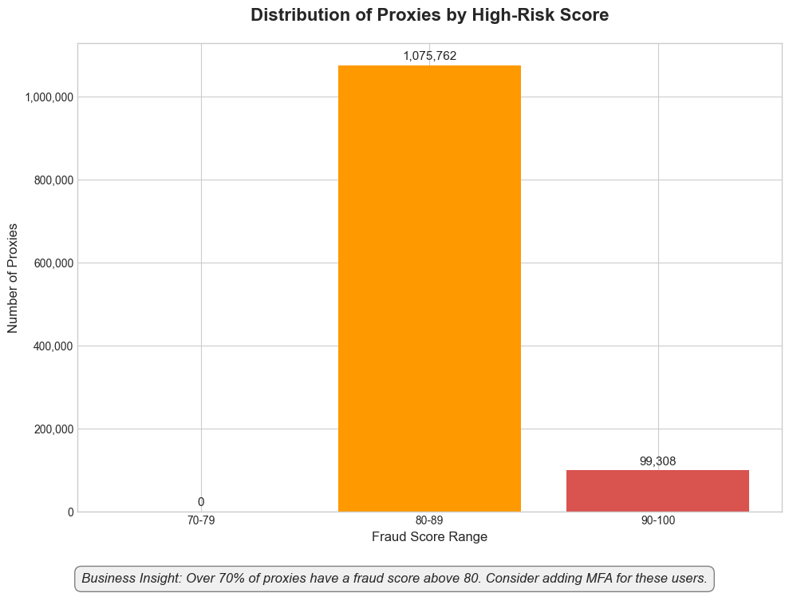
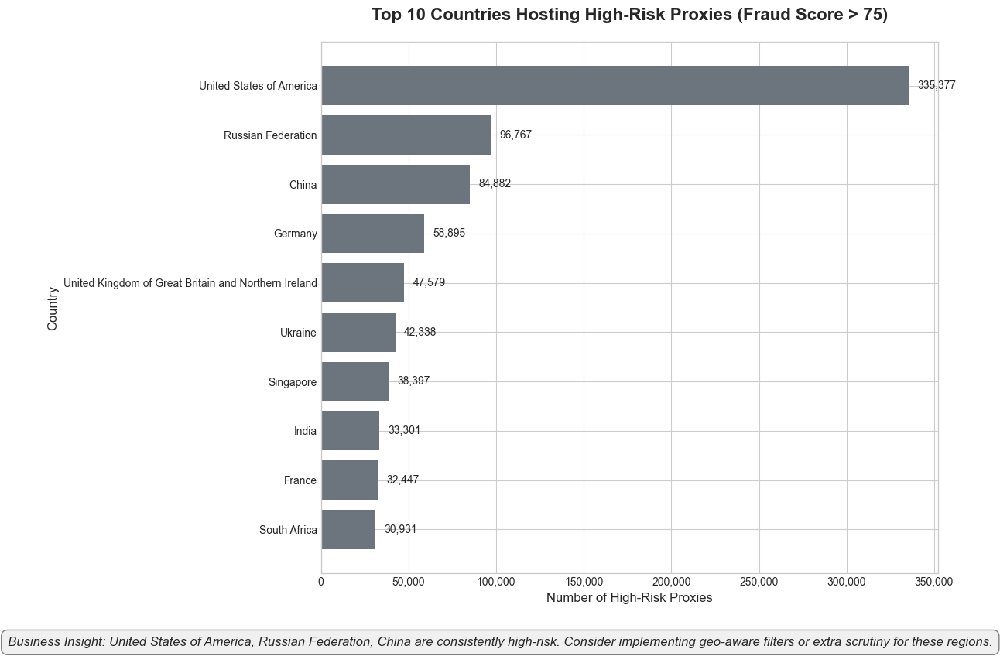
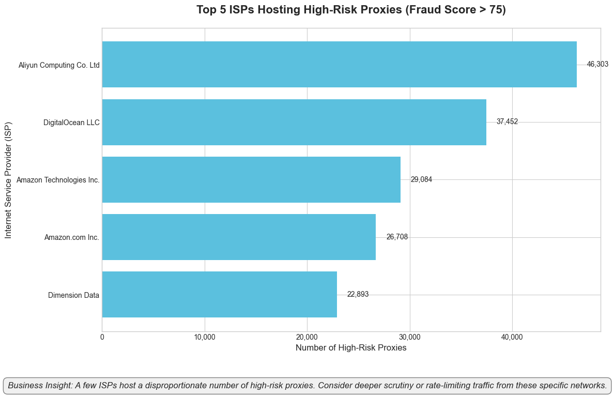

# Proxy Risk Project

This project analyzes proxy service risks using Python and provides interactive visualizations via a Streamlit dashboard.

## Features
- Loads and analyzes proxy risk data (fraud scores, countries, ISPs)
- Generates interactive charts with Plotly
- Streamlit dashboard for easy exploration
- GitHub-ready codebase (large datasets excluded)

## About the Dataset
This project uses a public proxy detection dataset to analyze risk profiles, geographic hotspots, and ISP trends. The dataset includes fields such as IP address, fraud score, country, ISP, and threat type. You can obtain a similar dataset from the Snowflake Marketplace:

[IP2Location IP2Proxy LITE Public Proxy Detection Database on Snowflake Marketplace](https://app.snowflake.com/marketplace/listing/GZTSZ3VACRT/ip2location-ip2proxy-lite-public-proxy-detection-database?search=proxy)

## Streamlit Dashboard & Insights
The Streamlit dashboard provides interactive visualizations and actionable insights:

- **Fraud Score Distribution**
  - 
  - Over 70% of proxies have a fraud score above 80. Consider enabling MFA for these users.

- **Top 10 High-Risk Countries**
  - 
  - High-risk proxies are concentrated in a few countries. Apply geo-aware filters or extra scrutiny for these regions.

- **Top 5 High-Risk ISPs**
  - 
  - A few ISPs host a disproportionate number of high-risk proxies. Consider monitoring or rate-limiting traffic from these ISPs.

- **Geographic Heatmap**
  - (See dashboard for interactive map)
  - Visualizes global risk concentrations, making it easy to spot emerging threats by region.

## Setup
1. Clone the repository:
   ```sh
   git clone https://github.com/Mugeshgithub/Proxy_risk_new.git
   cd Proxy_risk_new
   ```
2. Install dependencies:
   ```sh
   pip install -r requirements.txt
   ```
   Or manually:
   ```sh
   pip install pandas plotly streamlit kaleido
   ```
3. Place your dataset (e.g., `PROXYSCOPEW.csv`) in the project folder (not tracked by git).

## Usage
To launch the dashboard:
```sh
streamlit run app.py
```

## Notes
- The main dataset is not included in the repository due to GitHub file size limits. Please use the link above to obtain the data.
- All analysis code and dashboard logic are included.

## License
MIT 